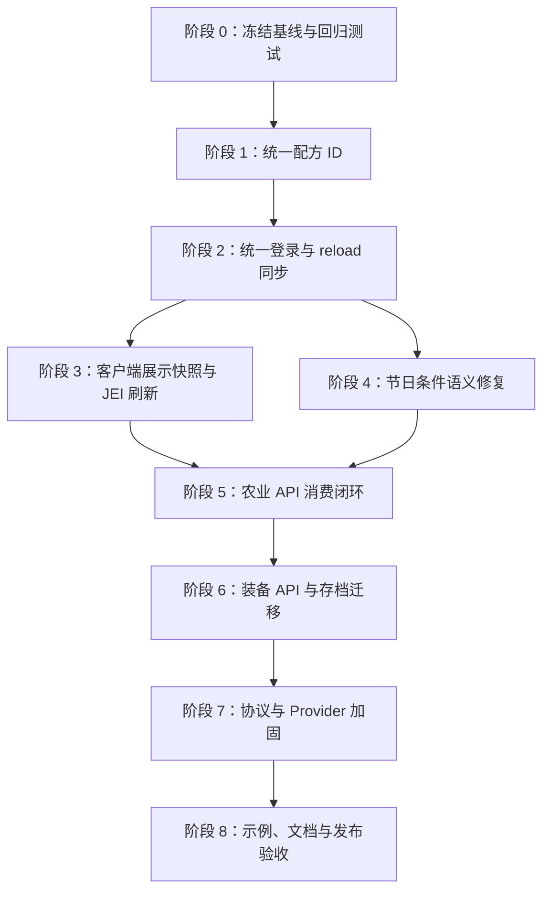

# StardewCraft 0.5 API 稳定化与缺陷修复开发规划

> 文档状态：实施中（第二轮自动化验收已完成）
> 适用范围：StardewCraft 0.5.x / Minecraft 1.21.1 / NeoForge 21.1.217
> 审查基线：`0.4.13(fd44eb2e) → 0.5.0(9f4c5e1c)`
> 首要目标：修复 0.5.0 API 更新引入的玩家可见回归，使公开 API 的注册、解析、运行时消费、客户端同步和重载行为形成可验证闭环

## 1. 文档目的

0.5.0 把大量本体内容迁移到了公共 Codec、Data Map、Provider 和数据包注册表。现有测试能够证明定义“可以解码”和 Provider“可以注册”，但不能证明这些定义已经真正进入玩法，也不能证明专用服务器客户端在登录和 `/reload` 后与服务端保持一致。

本规划用于约束后续修复，避免出现以下情况：

1. 只修复本体命名空间，第三方配方仍然无法购买或解锁。
2. 只在玩家登录时同步数据，执行 `/reload` 后在线客户端继续使用旧快照。
3. API 提供了字段和 Provider，但实际玩法仍读取旧硬编码表或 Java 类型。
4. 为了让客户端显示数据而把服务端 Action、条件或隐藏奖励逻辑全部下发。
5. 装备界面允许第三方物品进入槽位，却仍只保存物品 ID，导致 Data Component 或动态 Provider 状态丢失。
6. 单元测试全部通过，但示例附属进入真实服务器后没有作用。
7. 在当前脏工作区中混入无关格式化、重构或其他功能改动，使修复无法安全审阅。

本文只定义技术开发路径、分批边界、测试矩阵和验收条件。实施时按批次完成，每一批都应独立检查差异并通过对应验证，不能一次性改完所有系统再统一排错。

### 1.1 2026-07-15 实施记录

| 编号 | 当前结果 |
| --- | --- |
| API-01 / API-03 | 已统一合成、烹饪、商店、存档的配方 ID 规则；第三方命名空间不再丢失。 |
| API-02 | 当前工作区的工具赠送拦截修复保留。 |
| API-04 | 已改为 `OnDatapackSyncEvent` 统一处理登录与 `/reload`，并清理旧的重复发送入口。 |
| API-05 | 已接入作物收获、果树产物、动物产物、建筑容量/接受动物；无通用运行时语义的字段在公共文档中标为元数据。 |
| API-06 | 已统一装备槽解析和技能派发，装备存档/同步改为完整 `ItemStack`，旧字符串存档继续迁移。 |
| API-07 | 主动、被动节日共用世界条件判定；客户端日历使用服务端可用性快照。 |
| API-08 | 已同步邮件索引、商店/晶球 JEI DTO，并刷新现有 JEI 分类；JEI 启动后新增“全新分类”仍不支持。 |
| API-09 | 已增加单文档 4 MiB、总快照 16 MiB 上限与超限/截断测试。 |
| API-10 | 物品、农业、装备 Provider 已使用不可变快照并隔离单个异常；其余公共 Handler 保留最终差异审查门禁。 |

第二轮已补齐存档迁移、同步契约、示例附属和运行时 GameTest：

- `./gradlew test classes`：94 个单元/契约测试全部通过。
- `./gradlew runGameTestServer`：3 个必需 GameTest 全部通过，覆盖完整 `ItemStack` 存档往返、旧装备 ID 迁移、第三方装备 Provider 进入本体判定器。
- 隔离 gameDir 专用服务器启动到 `Done`，终止后完成 `All dimensions are saved`。
- 示例数据包静态校验通过 41 个 JSON 文档及跨文件关系，示例 Java 附属 `clean build` 通过。
- 同步测试额外发现并修复“服务端 reload 后注册表变为空集时，客户端仍保留旧条目”的残留快照问题。

真实客户端登录、在线 `/reload`、切换服务器和真实旧存档手工验收仍是发布前门禁，因此本记录不等于已完成第 15 节的全部发布验收。

## 2. 已确认问题与目标状态

| 编号 | 已确认问题 | 目标状态 | 优先级 |
| --- | --- | --- | --- |
| API-01 | 无命名空间配方在提交时被解析成 `minecraft:*` | 本体简写、完整本体 ID、第三方完整 ID 使用同一规范化规则 | P0，当前工作区已有修复 |
| API-02 | 工具类型兼容层失效，工具可进入 NPC 送礼流程 | 标签、公共物品类型和旧工具类型三层均能阻止赠送 | P0，当前工作区已有修复 |
| API-03 | 商店购买第三方配方时剥离命名空间 | `myaddon:recipe` 在解锁、判重、保存和制作时始终保持完整 ID | P0 |
| API-04 | `/reload` 后在线客户端注册表不更新 | 登录和重载统一走 NeoForge 数据包同步事件，在线客户端立即获得新快照 | P0 |
| API-05 | 农业 Provider 和大部分 Data Map 字段没有运行时消费者 | 每个承诺生效的字段都有明确消费者；仅元数据字段在文档中明确标注 | P1 |
| API-06 | 装备 `slot`、动态 Provider 和武器技能只接入了一部分 | 第三方装备可安全装备、保存、同步、计算属性并触发注册技能 | P1 |
| API-07 | 主动节日忽略 `available_when` | 主动、被动节日共享同一套可用性判定和明确的条件上下文语义 | P0 |
| API-08 | JEI、邮件收藏等客户端功能看不到服务器扩展内容 | 只同步客户端展示所需 DTO，并在快照变化后刷新客户端缓存和 JEI | P1 |
| API-09 | 大字符串解码无上限，单包同步缺少容量保护 | 有尺寸上限、失败诊断和覆盖大数据包的边界测试 | P2 |
| API-10 | 部分公共 Provider 抛异常会中断本体流程 | 每个 Provider 都隔离异常，记录 Provider ID 后继续回退链 | P2 |

## 3. 开发原则与兼容边界

### 3.1 0.5.x 兼容承诺

- 不删除或重命名 `com.stardew.craft.api.v1` 已公开的类、方法、记录字段和注册入口。
- 可以新增重载方法、内部解析器、运行时消费者、诊断和兼容适配器。
- 旧存档必须原地升级；不得要求玩家清空配方、邮件、装备或重新建档。
- 本体旧简写 ID 继续读取，但所有新写入统一使用规范化后的存储 ID。
- 如果网络负载格式必须改变，应显式更新网络协议版本；不能维持相同协议号却让旧客户端错误解码。

### 3.2 服务端权威边界

- 配方校验、购买扣款、条件判定、奖励、掉落、技能执行和装备写入由服务端决定。
- 客户端只接收界面、日历、收藏、提示和 JEI 所需的只读快照。
- 不为方便显示而向客户端发送公共 Action 的执行数据、隐藏奖励池或服务端私有状态。
- 客户端收到同步后必须替换旧快照，不能与旧数据累加。

### 3.3 工作区安全

当前工作区包含大量其他未提交改动。实施每一批前都必须：

1. 记录 `git status --short --branch`。
2. 只修改该批次列出的文件和测试。
3. 使用 `git diff -- <paths>` 检查局部差异，不运行全仓库格式化。
4. 不覆盖其他功能已经修改的代码；发现同文件重叠时先核对现有差异。
5. 默认不提交、不推送；只有得到明确授权后才进入 Git 发布流程。

## 4. 总体开发顺序



阶段 1、2、4 是应优先交付的玩家可见修复。阶段 3 依赖阶段 2 的统一同步入口。阶段 5、6 涉及公共 API 运行语义，必须在契约测试建立后实施，不能靠临时 `instanceof` 或注册名判断完成。

## 5. 阶段 0：冻结基线与建立失败测试

### 5.1 目标

在改业务代码之前，把已经确认的错误转化为自动化失败测试。测试必须证明运行契约，而不只是证明 JSON 可以解码。

### 5.2 保留当前已有修复

当前工作区已经包含两项 0.5.0 回归修复：

- `CraftingMenuCraftSubmitPayload.normalizeRecipeId` 对无命名空间 ID 使用 `stardewcraft` 默认命名空间。
- `StardewItemDataApi.legacyCategory`、工具标签和 `NpcInteractionService.canBeGivenAsGift` 共同阻止工具进入赠礼流程。

实施时应先把这两项局部差异与对应测试作为基线保留下来，不重新设计赠礼系统，也不把同时存在于 `NpcInteractionService` 的礼物喜好揭示改动混入本修复批次。

### 5.3 新增契约测试层级

| 测试层 | 用途 | 必须覆盖 |
| --- | --- | --- |
| 纯单元测试 | ID、优先级、异常回退、字段解析 | 不需要 Minecraft 世界的确定性规则 |
| 注册表快照测试 | reload 前后完整替换、命名空间和诊断 | 新定义、覆盖、删除、无效候选回滚 |
| GameTest | 方块、实体、装备和玩家存档行为 | 农业 Provider、装备交换、旧存档迁移 |
| 专用服务器烟雾测试 | 网络时序与客户端缺少服务端 datapack listener 的场景 | 登录、`/reload`、断线重连、服务器数据包 |
| 示例附属验收 | 验证公共 API 不是只对本体生效 | `examples/stardewcraft-addon` 和示例数据包 |

### 5.4 阶段验收

- 每个已确认问题至少有一个在 0.5.0 发布快照上能够失败的测试或可重复验证步骤。
- 新测试不能依赖执行顺序或本机已有世界。
- `ApiCodecRegistryTest`、`ExampleArtifactsTest` 继续承担 schema 测试，但不再被视为 API 可用性的唯一证据。

## 6. 阶段 1：配方 ID 规范化与商店购买闭环

### 6.1 单一规范

建立一个内部唯一的“配方定义 ID → 玩家存储 ID”入口。不要让合成提交、商店购买、解锁来源和商店可见性分别处理冒号。

规范如下：

| 输入 | 存储结果 |
| --- | --- |
| `apple_crate` | `apple_crate` |
| `stardewcraft:apple_crate` | `apple_crate` |
| `myaddon:apple_crate` | `myaddon:apple_crate` |
| `recipe:stardewcraft:apple_crate` | `apple_crate` |
| `recipe:myaddon:apple_crate` | `myaddon:apple_crate` |
| 空白、非法 ResourceLocation、多余前缀 | 拒绝，不扣款、不写存档 |

本体命名空间使用 path-only 是旧存档兼容规则；任何其他命名空间必须保留完整 ID。

### 6.2 实施路径

1. 新增内部 `RecipeIdNormalizer`，集中实现“原始 ID/`recipe:` 商店 ID → `ResourceLocation` → 玩家存储 ID”。
2. `StardewCraftingRecipeData.storageId` 和 `VanillaCookingRecipeData.storageId` 委托同一规范，避免把烹饪系统依赖到合成系统的具体类上。
3. `CraftingMenuCraftSubmitPayload` 使用同一入口，不再维护自己的解析分支。
4. `SaloonService.extractRecipeId` 不再通过第一个冒号截断命名空间；如果保留该方法，应让它委托统一解析器。
5. `ShopPurchasePayload` 在扣款前完成解析、存在性和已解锁检查；存在性检查必须覆盖商店当前支持的烹饪与合成两个配方目录，不能把沙龙烹饪配方误判为不存在。
6. `ShopRegistry` 的旅行货车结婚戒指判重改用规范化存储 ID，避免显示判断和购买写入使用不同格式。
7. 检查 `UnlockSourceData`、烹饪锅、合成菜单和所有 `isRecipeUnlocked/unlockRecipe` 调用者，禁止继续传入未经规范化的定义 ID。

### 6.3 回归测试

- 本体简写、本体完整 ID、第三方完整 ID 得到预期存储 ID。
- `recipe:myaddon:apple_crate` 购买后玩家拥有 `myaddon:apple_crate`，没有错误的 `apple_crate`。
- 已解锁第三方配方不会重复扣款。
- 已解锁结婚戒指不再出现在旅行货车配方项中。
- 无效 ID 和不存在的配方均不扣钱、不扣库存、不写玩家数据。

### 6.4 阶段验收

- 同一配方在“显示、购买、解锁、制作、存档重载”五个环节使用相同存储 ID。
- 示例数据包的 `example_stardew_addon:apple_crate` 能通过正常游戏入口解锁并制作。

## 7. 阶段 2：统一登录与 `/reload` 数据同步生命周期

### 7.1 统一同步入口

新增窄职责的 `ClientContentSyncService`，负责构造并发送客户端所需内容快照。同步触发统一接入 NeoForge `OnDatapackSyncEvent`：

- 玩家登录时，事件提供单个相关玩家。
- 执行 `/reload` 时，事件提供全部在线玩家。
- 使用 `event.getRelevantPlayers()`，避免自己重复判断登录和全员广播。

`PlayerDataEventHandler` 中直接调用 `DataRegistrySyncPayload.sendFullSync` 的逻辑应移除，防止登录时发送两次。玩家个人存档、任务日志、特殊订单状态等非 datapack 数据仍保留原登录同步流程。

### 7.2 快照一致性

- 服务端只从各注册表已经提交成功的当前快照构造网络数据。
- 单个注册表 reload 失败时继续保留上一个有效快照，不能把空字符串当作“清空客户端”。
- 客户端应用新文档时执行完整替换；服务端删除一条定义后，客户端 `/reload` 后也必须删除。
- 为同步批次增加单调递增的 `revision` 或内容哈希。为保持现有 payload 字段顺序，可用独立的小型批次标记 payload 承载 revision；客户端忽略比当前 revision 更旧的批次，避免网络延迟造成回退。
- 日志至少包含 revision、接收者数量、各文档字节数和总字节数；不打印完整 JSON。

### 7.3 保持 0.5.x 网络兼容的方法

第一步优先保持现有 `DataRegistrySyncPayload` 字段顺序不变，只改变发送时机。若阶段 3 需要新增文档，优先新增独立 payload，不在现有 record 中间插入字段。

如果后续决定用统一版本化 envelope 替代现有 payload，则必须：

1. 新建 payload 类型或明确更新 `PacketHandler` 协议版本。
2. 不让相同协议号的旧客户端按旧字段顺序解码新数据。
3. 在发布说明中声明服务端和客户端必须使用相同补丁版本。

### 7.4 回归测试

- `OnDatapackSyncEvent` 登录分支只向加入玩家发送一次。
- `/reload` 分支向当前全部在线玩家发送一次。
- 客户端先应用 revision N，再收到 N-1 时保持 N。
- 注册表新增、修改、删除后，客户端缓存与服务端快照等价。
- 无效候选 reload 不改变服务端或客户端最后有效快照。

### 7.5 手工验收

在专用服务器上连接客户端，修改测试数据包后执行 `/reload`，不重连并逐项检查：

- 合成菜单配方。
- 烹饪锅配方。
- 节日日历。
- 精通奖励界面。
- 地点/音乐区域。
- 职业说明。

## 8. 阶段 3：客户端展示快照、邮件收藏与 JEI 刷新

### 8.1 先分类，不把所有服务端注册表都同步

每个数据注册表必须被划入以下一类：

| 类型 | 处理方式 | 示例 |
| --- | --- | --- |
| 客户端直接查询 | 同步完整的客户端安全定义或只读 DTO | 节日日历、配方展示、地点显示 |
| 打开界面时由服务端解析 | 继续发送已解析界面 payload | 玩家可购买商店库存、任务状态 |
| 仅服务端执行 | 不同步原始定义 | 奖励 Action、掉落判定、隐藏池、世界生成规则 |

本阶段首先处理已经有具体客户端消费者的缺口，不追求把所有 API 注册表塞进一个大包。

### 8.2 邮件收藏

新增客户端安全的邮件索引 DTO，至少包含：

- 规范化邮件 ID。
- 收藏页标题所需的翻译键或服务端已解析标题。
- 排序信息。

不要同步 `on_read` Action。信件实际正文仍由现有阅读 payload 提供，避免客户端本地注册表成为服务端行为来源。

`StardewGameMenuScreen.letterCollectionEntries()` 改为读取客户端邮件索引缓存；断线或退出世界时清空缓存，防止连接另一个服务器后残留旧邮件。

### 8.3 JEI 数据源

为 JEI 建立只读的 `ClientJeiContentSnapshot`，只包含现有分类需要显示的数据：

- 钓鱼信息。
- 工匠机器配方。
- 合成配方。
- 商店展示条目。
- 晶球展示条目。

商店和晶球应同步展示 DTO，而不是把服务端条件、库存 Provider 或掉落 Action 直接交给客户端执行。

### 8.4 JEI 运行时刷新

`StardewJeiPlugin` 实现以下生命周期：

1. `onRuntimeAvailable` 保存 `IJeiRuntime`，并发布当前客户端快照。
2. 内容同步完成后通知 JEI 适配层刷新。
3. 刷新前隐藏上一批由 StardewCraft 发布的 recipe 对象，再添加新批次，避免重复显示和保留已删除定义。
4. `onRuntimeUnavailable` 清空 runtime 引用和已发布对象列表。
5. 当 JEI 未安装或 runtime 尚未可用时，只更新客户端缓存，不触碰 JEI 类。

如果 JEI 当前版本无法真正移除运行时 recipe，应使用“隐藏旧批次 + 添加新批次”的兼容策略，并通过稳定 ID 确保同一快照不会重复发布。

### 8.5 回归测试与验收

- 服务器数据包新增邮件后，收到邮件的玩家能在收藏页看到它。
- 邮件索引不包含服务端 Action。
- 登录专用服务器后，JEI 能看到服务器新增的第三方合成、钓鱼、工匠、商店和晶球条目。
- `/reload` 删除条目后，旧条目不再可见；连续 reload 不产生重复项。
- 从服务器 A 退出并进入服务器 B 后，不显示 A 的邮件和 JEI 数据。

## 9. 阶段 4：节日条件语义修复

### 9.1 统一入口

把“按日期查找节日”和“判断是否可用”合并到一个共享查询流程。以下调用者不能再自己只过滤日期：

- 主动节日当天判定。
- 被动节日当天判定。
- 节日开始和结束生命周期。
- 商店营业时间覆盖。
- 日历和客户端提示。
- 调试强制节日入口。

建议新增内部 `FestivalQueryContext`，包含 `ServerLevel`、日期、时间、可选玩家和是否为调试覆盖。正常流程必须执行 `available_when`；调试命令只有显式声明“忽略条件”时才可绕过。

### 9.2 世界条件与玩家条件

节日是否存在是世界级状态，0.5.x 的 `available_when` 因此定义为世界条件：

- 日期、天气、世界旗标等可以用于 `available_when`。
- 需要玩家对象的金钱、物品、玩家技能和个人旗标不应用于世界级节日调度。
- 对本体已知的玩家型 Condition，在节日定义加载时生成明确诊断，而不是运行时用 `player=null` 静默失败。
- 自定义 Condition 若依赖玩家，应由附属在自己的 Handler 内执行玩家入场判定；未来如需公共支持，使用新增 `entry_when` 字段或 API v2，不改变 0.5.x 现有字段的世界语义。

这样可以避免用“第一个在线玩家”或“任意玩家满足”决定全世界节日状态的不稳定行为。

### 9.3 多节日冲突

同一天若有多个满足条件的主动节日，不能依赖资源加载顺序。应建立确定性选择规则：

1. 显式 priority（如果 0.5.x 定义已有该字段）。
2. 完整 namespaced ID 字典序作为稳定兜底。
3. 若没有公开 priority 字段，不为本修复临时扩大 schema；先按完整 ID 稳定排序并记录冲突警告。

### 9.4 回归测试

- 日期相同、条件一真一假的主动节日只选择条件成立者。
- 主动和被动节日使用相同条件结果。
- 无世界上下文时不启动节日，并输出可定位诊断。
- 同日多主动节日每次选择结果相同。
- 调试覆盖不会污染正常条件查询。

## 10. 阶段 5：农业 API 运行时消费闭环

### 10.1 先建立字段—消费者真值表

农业数据不能笼统宣称“已接入”。实施前为每个字段记录以下信息：

- 服务端实际消费者。
- 是否改变本体玩法。
- 是否仅供附属查询。
- 所需上下文（世界、坐标、方块状态或实体）。
- 没有安全通用语义时的明确边界。

最低目标表：

| 数据 | 优先接入的本体消费者 | 不能继续存在的状态 |
| --- | --- | --- |
| Crop | `StardewCropBlock` 收获经验、季节与收获相关入口 | 只调用 `crop(state)` 并绕过动态 Provider |
| Tree | `FruitTreeRules`、果树成熟/产物流程、可适配的树木收获入口 | Provider 注册后全项目零调用 |
| Animal | `AnimalAcquireService`、动物成熟和产物流程 | 购买、成熟、产物继续只读固定目录 |
| Building | Coop/Barn 校验与容量检查 | `acceptedAnimals/capacity` 从未参与验证 |

### 10.2 Provider 调用规则

- 所有需要世界语义的消费者使用 `crop(level,pos,state)`、`tree(level,pos,state)`、`animal(entity)`、`building(level,pos,state)`。
- Provider 顺序保持“高优先级优先，同优先级完整 ID 排序，最后回退 Data Map”。
- 调用 Provider 时不持有可重入的全局锁；注册完成后读取不可变快照。
- 单个 Provider 抛出运行时异常时记录 Provider ID 和目标 ID，然后继续下一个 Provider/Data Map。
- 服务端决定玩法结果；客户端查询只用于显示，不能反向修改世界。

### 10.3 不伪造通用玩法

任意第三方 `Block` 或 `Entity` 不一定拥有 StardewCraft 的年龄属性、果实存储、建筑内部或动物存档模型。因此：

- 能够接入现有 StardewCraft 流程的字段必须真正接入并测试。
- 只能描述、无法驱动任意对象的字段，在 Javadoc 和 `docs/0.5-addon-api.md` 中标记为“元数据/附属查询用途”。
- 不通过方块注册名猜测 age、seed、produce 或建筑类型。
- 不为了宣称“支持任意作物”而全局接管所有 Minecraft `CropBlock` 的生长和掉落。

### 10.4 示例附属

扩展示例附属，至少提供：

- 一个动态 crop provider，返回与静态 Data Map 不同的收获经验，用来证明 Provider 优先级和世界上下文生效。
- 一个 Data Map 装配的动物或建筑测试定义，用来证明对应本体消费者确实读取公共数据。
- 一个故意抛异常的低优先级 Provider，仅用于测试回退和日志，不进入发布示例玩法。

### 10.5 阶段验收

- Crop、Tree、Animal、Building 四条 Provider 注册链都至少有一个真实的 StardewCraft 运行时消费者；单个无法通用于任意对象的数据字段可以明确标记为只读元数据。
- 公开文档中的每个“会影响玩法”声明都能指向测试。
- 示例 provider 不需要修改 StardewCraft 本体注册表即可影响承诺范围内的行为。

## 11. 阶段 6：装备 API、完整物品栈存档与技能路由

### 11.1 槽位判定统一化

新增内部 `EquipmentSlotResolver`：

1. 优先读取 `StardewEquipmentDataApi.get(stack).slot()`。
2. 没有公共数据时回退现有 `StardewRingItem`、`CombinedRingItem`、`StardewBootsItem` 兼容判断。
3. `EquipmentActionPayload`、属性计算、界面提示和可选 Curios 兼容使用同一结果。
4. 服务端再次验证槽位，不能信任客户端发送的目标槽。

### 11.2 为什么必须迁移为完整 `ItemStack`

当前戒指和靴子槽主要保存物品 ID。公共装备 Provider 是 stack-aware；如果装备时只保存 ID，品质、Data Component、耐久、自定义名称和 Provider 所依赖的动态状态都会丢失。

因此完整支持动态 Provider 的正确路径是：

- 玩家数据新增完整 `ItemStack` 形式的左右戒指和靴子字段。
- 读取旧存档字符串时构造默认栈并写入新字段，保留旧 getter 作为 0.5.x 兼容适配。
- 新存档只写完整栈；必要时短期同时写旧 ID 作为降级信息，但读取以新字段为准。
- 玩家数据网络同步和装备界面交换完整栈。
- 属性解析器直接读取已装备栈，不再通过 ID 重新构造无组件物品。
- 任意交换、死亡、断线和存档重载都不能复制或吞掉装备。

### 11.3 武器技能统一路由

建立一个服务端 `WeaponSkillDispatcher`：

1. 从玩家当前手持完整栈读取 `StardewEquipmentDataApi`。
2. 根据主/副技能选择 `primarySkill/secondarySkill`。
3. 查找 `StardewWeaponSkillHandlers` 并执行，传入现有 `StardewWeaponSkillContext`。
4. 公共技能不存在或 Handler 返回 `PASS` 时，再回退本体 `IStardewWeapon.useSkill`/内部 `WeaponData`。
5. 客户端按键或现有技能 payload 只表达“请求主技能/副技能”，最终栈、技能 ID、冷却和执行由服务端重新解析。

这样第三方物品不必继承 `StardewWeaponItem` 才能使用公共技能 Handler，同时保持所有本体武器现有行为。

### 11.4 Provider 安全

`StardewEquipmentDataApi` 改用不可变 Provider 快照读取，并像物品 API 一样捕获单个 Provider 的运行时异常。异常后继续 Data Map 和旧本体回退，不能让一个附属 Provider 破坏整个装备界面或战斗输入。

### 11.5 回归测试

- Data Map 声明为 ring/boots 的第三方物品可以进入正确槽位，不能进入错误槽位。
- 带 Data Component 的装备经过装备、保存、重载、卸下后组件完全一致。
- 旧字符串装备存档自动迁移且属性不丢失。
- 交换装备时背包、鼠标栈和装备槽总物品数守恒。
- 第三方普通 Item 通过公共装备数据和技能 Handler 成功触发主/副技能。
- 未知技能、异常 Provider 和 Handler `PASS` 均安全回退。
- 本体戒指、组合戒指、靴子和全部现有武器行为不变。

## 12. 阶段 7：网络负载与公共 Provider 加固

### 12.1 网络边界

现有 `readLargeString` 直接信任远端 VarInt 长度并分配数组。本阶段应：

1. 统计内置数据和扩展示例在实际编码后的单文档、总 payload 大小。
2. 根据实测值和 NeoForge 当前 payload 限制确定单文档及总批次上限，不凭感觉写任意常量。
3. 解码前验证长度非负、未超过剩余可读字节、未超过配置上限。
4. 超限时安全拒绝并输出文档类型、声明长度和上限，不分配目标数组。
5. 为接近上限、刚好越界、截断 VarInt、截断正文编写测试。

如果实测扩展数据已经接近传输上限，再引入分块或压缩；不要在没有容量证据时先写复杂协议。分块时必须包含 revision、chunk index、chunk count、总长度和内容哈希，客户端只有收齐且校验成功后才提交快照。

### 12.2 Provider 统一安全约束

逐一检查公共 Provider/Handler：

- Item Data。
- Agriculture Data。
- Equipment Data。
- NPC Interaction。
- Shop Inventory。
- Profession Effect。
- Mine Monster。

统一最低行为：

- 注册 ID 唯一。
- 顺序确定。
- 运行异常记录提供者 ID 和必要上下文。
- 单个附属异常不会阻止本体回退。
- 不在遍历时持有注册锁。

只在确实存在三处以上完全相同逻辑时抽取共享内部工具；否则保持各 API 的局部实现，避免为了“统一”引入新的公共抽象。

## 13. 阶段 8：示例、文档与发布验收

### 13.1 更新公共文档

完成代码后同步更新 `docs/0.5-addon-api.md`：

- 配方 ID 的输入与存储规范。
- `/reload` 后客户端同步保证。
- 哪些注册表会同步客户端，哪些只在服务端执行。
- 节日 `available_when` 的世界级条件语义。
- 农业每个字段是玩法消费者还是只读元数据。
- 动态装备 Provider 对完整 ItemStack 的支持。
- 第三方武器技能的输入入口和服务端权威边界。

不得继续使用“支持”“稳定”“同步”等无法由测试证明的笼统表述。

### 13.2 示例必须成为验收夹具

`examples/stardewcraft-addon` 和 `examples/stardewcraft-data-pack` 不只是展示文件，还应作为回归夹具覆盖：

- 第三方命名空间配方购买、解锁和制作。
- 登录及 `/reload` 后客户端快照变化。
- 第三方邮件收藏索引。
- JEI 显示第三方配方、商店和晶球。
- 农业 Provider 的真实消费者。
- 第三方装备槽和技能 Handler。
- 条件成立/不成立的主动节日。

### 13.3 最终验证矩阵

每一批至少执行：

```text
./gradlew test
./gradlew classes
```

最终合并前再执行：

```text
./gradlew runGameTestServer -PisolatedRun=true
./gradlew runServer -PisolatedRun=true
```

人工验证矩阵：

| 环境 | 必测行为 |
| --- | --- |
| 单人游戏 | 旧存档升级、配方、装备、节日条件 |
| 专用服务器 + 同版本客户端 | 登录同步、`/reload`、重连、邮件收藏、JEI |
| 专用服务器 + 示例数据包 | 第三方命名空间和服务器扩展内容 |
| 专用服务器 + 示例附属 | Provider、装备槽、技能 Handler |
| 无 JEI | 客户端同步正常，JEI 兼容代码不加载 |
| 有 JEI | 首次登录、连续 reload、切换服务器均无重复或残留 |

## 14. 建议实施批次与文件边界

### 批次 A：玩家可见紧急修复

范围：API-01、API-02、API-03、API-07。

主要文件：

- `network/payload/CraftingMenuCraftSubmitPayload.java`
- `player/StardewCraftingRecipeData.java`
- `shop/SaloonService.java`
- `network/payload/ShopPurchasePayload.java`
- `shop/ShopRegistry.java`
- `api/v1/item/StardewItemDataApi.java`
- `npc/runtime/NpcInteractionService.java`
- `festival/FestivalService.java`
- 对应单元测试

### 批次 B：数据同步生命周期

范围：API-04、API-09 的基础限制。

主要文件：

- `network/DataRegistrySyncPayload.java`
- 新增内部 `ClientContentSyncService`
- `player/PlayerDataEventHandler.java`
- `network/PacketHandler.java`（仅在新增 payload 或协议版本时）
- 同步事件和 codec 测试

### 批次 C：客户端展示一致性

范围：API-08。

主要文件：

- `mail/MailRegistry.java` 或新的邮件索引 DTO/缓存
- `client/gui/menu/StardewGameMenuScreen.java`
- `integration/jei/StardewJeiPlugin.java`
- 商店/晶球客户端展示 DTO
- 客户端断线清理入口

### 批次 D：农业契约

范围：API-05、农业部分 API-10。

主要文件：

- `api/v1/agriculture/StardewAgricultureDataApi.java`
- `block/crop/StardewCropBlock.java`
- `tree/fruit/FruitTreeRules.java` 及实际果树消费者
- `animal/service/AnimalAcquireService.java`
- 动物产物与 Coop/Barn 校验服务
- 示例附属和 GameTest

### 批次 E：装备契约与存档迁移

范围：API-06、装备部分 API-10。

主要文件：

- `api/v1/equipment/StardewEquipmentDataApi.java`
- `network/payload/EquipmentActionPayload.java`
- `combat/equipment/EquipmentResolver.java`
- `player/PlayerStardewData.java`
- 玩家数据同步 payload/cache
- 新增内部 `EquipmentSlotResolver`、`WeaponSkillDispatcher`
- 旧存档迁移和 GameTest

### 批次 F：加固、示例和文档

范围：剩余 API-09、API-10 与发布验收。

每个批次都应保持原子目标；批次 A 不顺便重构同步协议，批次 B 不顺便改农业，批次 E 不顺便重写整个战斗系统。

## 15. 完成定义

只有同时满足以下条件，才能宣布 0.5 API 稳定化完成：

1. 所有 API-01 至 API-10 都有代码修复、明确边界或可验证的“不支持”说明。
2. 公开 API 的每个“会影响本体玩法”声明都有至少一个运行时测试。
3. 第三方命名空间 ID 在读取、网络、存档和 UI 中不被意外降级为本体简写。
4. 登录、`/reload`、断线重连和切换服务器不会产生客户端旧数据、重复数据或跨服务器残留。
5. 示例附属不修改 StardewCraft 本体源码即可完成配方、农业、装备、技能和节日验收场景。
6. 旧 0.5.0 玩家存档可以直接载入，配方与装备不丢失、不复制。
7. `test`、`classes`、GameTest 和专用服务器启动验证全部通过。
8. 局部差异中不包含与 API 稳定化无关的格式化、资源或玩法改动。

## 16. 不在本轮扩张的内容

- 不借此新增第六种技能、任意职业槽或新的核心存档模型。
- 不把所有世界生成、奖励池和服务端 Action 同步到客户端。
- 不建立一个全新的通用数据框架替换现有所有 ReloadListener。
- 不全局接管任意第三方 Minecraft 作物、树、动物和建筑的完整生命周期。
- 不为了修复装备 API 重写全部本体武器技能实现。
- 不在没有实测容量问题时提前实现复杂压缩、分块和重传协议。

本轮的判断标准不是“API 文件数量更多”，而是公开入口所承诺的行为能够在本体、示例附属、专用服务器和 `/reload` 场景中被重复验证。
