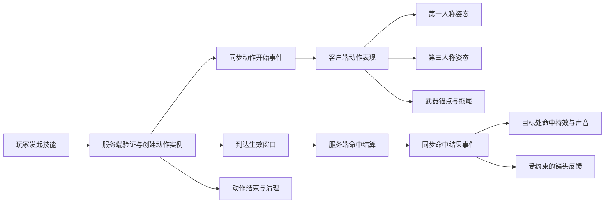

# StardewCraft 武器动作与特效研究基线

> 状态：研究结论冻结版 v1
>
> 目标版本：Minecraft 1.21.1 / NeoForge
>
> 固化日期：2026-07-28
>
> 当前阶段：只定义原则、架构边界与验收标准，不代表现有实现已经达标

## 1. 文档目的

这份文档回答一个问题：

**在尊重 Minecraft 原版空间感、渲染方式和多人游戏模型的前提下，StardewCraft 应该怎样实现一套动作可信、反馈清楚、视觉统一、性能可控的原创武器特效系统？**

本文是后续武器动作和特效工作的研究基线。除非重新审查并修改本文，后续实现不得绕过这里已经冻结的原则。

本文不负责：

- 复制星露谷原版不存在的技能设计。StardewCraft 的武器技能全部是原创内容。
- 复制 Better Combat、Epic Fight、Iron's Spells 等项目的技能、素材、动画或代码。
- 立即决定每个技能的最终美术方案。
- 修改伤害数值。战斗数值管线另行管理。

本文继承的项目约束：

- 武器、怪物和战斗语义要尊重星露谷原版，但不机械照搬到 Minecraft。
- 原版没有对应内容时，优先延续星露谷的克制、清晰和物品身份，而不是凭空制造夸张的“通用魔幻特效”。
- 非 Stardew 维度不再使用 `5:1` 武器伤害映射。
- 原创技能可以超出原版能力边界，但必须在项目内部逻辑自洽。

## 2. 冻结结论

以下结论从 v1 起视为强制基线。

### 2.1 特效必须服从战斗因果

正确顺序必须是：

1. 动作进入前摇。
2. 武器接近打击位置。
3. 服务器在生效帧结算命中。
4. 客户端在同一生效窗口播放命中、音效和必要的镜头反馈。
5. 动作进入后摇。

服务器仍然拥有最终判定权，但视觉不能出现“目标先掉血，武器随后才挥到”的倒置因果。

如果一个技能设计上就是瞬发，它可以在第 0 帧生效；此时动作也必须从释放或打击姿态开始，不能添加发生在伤害之后的伪前摇。

### 2.2 普通近战刀光必须来自真实武器运动

普通近战挥砍的拖尾必须由刀刃根部和尖端的连续位置生成。

禁止把以下做法称为“武器拖尾”：

- 根据玩家位置和朝向，在世界中画一张固定弧形面片。
- 不读取武器动作，只在玩家前方播放通用 `SWEEP_ATTACK`。
- 用一张巨大透明白贴图遮盖动作不完整的问题。
- 所有剑、匕首和重武器共用同一条几何弧线。

固定斩击贴片仍然可以存在，但它只能表达已经脱离武器的剑气、冲击波或风刃，不能冒充武器本身经过空间留下的轨迹。

### 2.3 特效表现由少量可复用的视觉原语组成

技能不能继续依靠“在一个巨大 `switch` 中随机拼接原版粒子”来获得身份。

项目需要形成自己的视觉原语库：

- 刀刃拖尾。
- 定向斩击。
- 命中火花。
- 材质碎屑。
- 元素微粒。
- 地面脉冲或冲击波。
- 标记与状态附着。
- 持续区域的发射器或效果实体。
- 受约束的音效、镜头震动和屏幕反馈。

一个技能可以组合这些原语，但每种原语必须拥有清楚的职责、寿命、朝向、光照和性能边界。

### 2.4 服务端同步意图和结果，客户端生成表现

服务端负责：

- 技能是否合法。
- 动作开始时间。
- 生效窗口。
- 命中目标与命中结果。
- 随机种子。
- 需要所有观察者一致看到的事件。

客户端负责：

- 姿态插值。
- 武器拖尾采样。
- 自定义粒子实例。
- 材质、透明度、光照和淡出。
- 本地镜头反馈。

网络包不应逐帧传输顶点或粒子坐标。它应发送足以让客户端重建视觉的事件身份、时间、施法者、目标和确定性种子。

### 2.5 第一人称和第三人称必须共享同一动作语义

第一人称与第三人称可以有不同的镜头适配，但必须共享：

- 同一个动作实例。
- 同一个标准化进度。
- 同一个生效帧。
- 同一个武器方向和攻击类型。
- 同一个特效身份。

不能只修改 `ItemInHandRenderer`，然后让其他玩家仍然只看到原版 `swing`。

### 2.6 全亮、透明和屏幕特效是强调手段，不是默认风格

- 普通金属刀光不应默认全亮。
- 发光只能用于明确具有能量或魔法属性的核心、边缘或瞬间强调。
- 透明几何必须验证遮挡、排序、穿墙和与地形相交的表现。
- 不得使用 `see-through` 风格绕过遮挡，除非技能机制明确要求隔墙可见。
- 后处理和屏幕遮罩只能用于极少数核心技能，并且必须可配置、可降级。

### 2.7 不以粒子数量代替品质

低粒子设置下，动作本体和核心轮廓仍应表达技能。

粒子承担的是：

- 解释材质。
- 强化方向。
- 确认命中。
- 补充余韵。

粒子不承担掩盖动作错误、命中不同步或缺乏技能构图的职责。

## 3. Minecraft / NeoForge 1.21.1 的实现基础

### 3.1 客户端和服务端边界

Minecraft 是服务端权威模型。逻辑服务端负责实体、伤害和状态，逻辑客户端负责展示。客户端渲染类不能泄漏到独立服务端加载路径。

因此：

- 伤害、击退、状态和资源消耗只在服务端结算。
- 动作和特效事件通过 payload 同步。
- 必须使用独立服务端验证，而不能只在单人世界验证。
- 客户端静态状态不能被当作服务端事实来源。

参考：

- [NeoForge 1.21.1：Sides](https://docs.neoforged.net/docs/1.21.1/concepts/sides/)
- [NeoForge 1.21.1：Networking](https://docs.neoforged.net/docs/1.21.1/networking/)

### 3.2 自定义粒子

NeoForge 1.21.1 的标准路径是：

1. 注册 `ParticleType`。
2. 客户端注册 `ParticleProvider`。
3. 优先从 `TextureSheetParticle` 派生。
4. 使用 `SpriteSet` 管理动画帧。
5. 在 `assets/<namespace>/particles` 中声明粒子贴图序列。
6. 根据视觉需求选择粒子图集对应的 opaque、translucent 或 lit 渲染类型。

自定义粒子适合：

- 短寿命的斩击贴片。
- 火花、叶片、星屑、毒液、冰晶等微粒。
- 水平朝向的冲击波。
- 短暂残影和轨迹片段。

自定义 `ParticleOptions` 只在需要传递颜色、尺寸、方向、生命周期等实例数据时使用。仅客户端可推导的数据不必全部经过服务端。

参考：

- [NeoForge 1.21.1：Particles](https://docs.neoforged.net/docs/1.21.1/resources/client/particles/)

### 3.3 动态几何和渲染批次

真正的连续刀刃拖尾不一定能用普通面向摄像机的粒子完成。它可以由专用粒子或共享的批量拖尾渲染器生成动态几何。

Minecraft 1.21 的顶点系统要求正确使用 `VertexConsumer`、`MultiBufferSource`、`RenderType` 和批次结束时机。透明 `RenderType` 还涉及上传排序。

项目规则：

- 不为每个技能复制一套 `RenderLevelStageEvent` 顶点代码。
- 所有同类拖尾进入共享运行时和共享批次。
- 不在每一帧创建新的纹理标识、渲染类型或长期容器。
- 世界空间顶点必须正确减去摄像机位置。
- 每个动态效果都必须处理资源重载、世界退出和实体消失。
- 透明效果必须专门验证排序，不能仅以“能显示”为完成。

参考：

- [NeoForge 1.21 渲染迁移说明](https://docs.neoforged.net/primer/docs/1.21/#oh-rendering-why-must-you-change-so)

### 3.4 效果实体和持续发射器

持续时间较长、需要跟随实体、具有世界身份或需要多人稳定同步的效果，不应强行塞进一次性粒子调用。

选择规则：

| 表现类型 | 首选载体 |
| --- | --- |
| 短促火花、碎屑、叶片 | 自定义粒子 |
| 脱离武器的短寿命斩击 | 定向自定义粒子 |
| 真实刀刃连续拖尾 | 专用拖尾粒子或共享拖尾渲染器 |
| 短暂地面冲击波 | 水平定向自定义粒子 |
| 持续跟随角色的光环 | 客户端发射器，状态由服务端同步 |
| 有独立位置、碰撞或较长寿命的场域 | 效果实体及其 renderer |
| 极少数全屏高潮效果 | 可降级的后处理或屏幕效果 |

`RenderLevelStageEvent` 本身不是禁用项，但它只能用于确实需要世界阶段渲染的共享系统，不能继续成为每个技能各画各的万能入口。

## 4. 成熟项目源码研究

研究对象只用于理解工程模式。后续不得复制其素材、原创技能或专属视觉设计。

### 4.1 Better Combat 1.21.1

固定研究提交：

`e4a6a4a2ae109045d7a1eae334728bd726c305ea`

关键发现：

- 武器攻击定义包含动画、范围、角度和 `upswing`。
- 源码明确要求实际攻击时间尽可能对齐动画的打击点。
- 攻击动画消息包含玩家、手、动画名、时长、前摇、范围、前摇 tick 和粒子描述。
- 动作消息会被用于其他观察者的动画显示，而不是只有施法者本机知道。
- 斩击不是临时调用一堆原版粒子，而是短寿命、自带朝向、颜色、光照和 sprite 动画的专用粒子。
- 普通斩击粒子生命周期很短，视觉重点集中在动作发生的几帧。

可采纳的工程思想：

- 数据明确描述攻击时间轴。
- 命中点与动作拐点对齐。
- 同步动作身份而非同步每帧几何。
- 将斩击外观做成有限、可组合的配置。

不可直接照搬：

- Better Combat 的连段规则。
- 它的动画资源和武器属性格式。
- 它对 StardewCraft 原创技能的具体表现判断。

源码：

- [WeaponAttributes.java](https://github.com/ZsoltMolnarrr/BetterCombat/blob/e4a6a4a2ae109045d7a1eae334728bd726c305ea/common/src/main/java/net/bettercombat/api/WeaponAttributes.java)
- [Packets.java](https://github.com/ZsoltMolnarrr/BetterCombat/blob/e4a6a4a2ae109045d7a1eae334728bd726c305ea/common/src/main/java/net/bettercombat/network/Packets.java)
- [SlashParticle.java](https://github.com/ZsoltMolnarrr/BetterCombat/blob/e4a6a4a2ae109045d7a1eae334728bd726c305ea/common/src/main/java/net/bettercombat/client/particle/SlashParticle.java)
- [SlashParticleUtil.java](https://github.com/ZsoltMolnarrr/BetterCombat/blob/e4a6a4a2ae109045d7a1eae334728bd726c305ea/common/src/main/java/net/bettercombat/client/particle/SlashParticleUtil.java)

### 4.2 Epic Fight 1.21.1

固定研究提交：

`a78aa24b72e90a9d09f5fd61925e4369d117abaf`

关键发现：

- 拖尾定义包含刀刃起点、终点、绑定关节、出现时间、结束时间、淡出时间、插值数、寿命、更新间隔、颜色、光照和纹理。
- 动画拖尾从上一姿态、中间姿态和当前姿态中计算武器关节变换。
- 刀刃的起点与终点经过角色模型和关节矩阵变换后，才成为世界空间中的轨迹边。
- 拖尾只在动画配置的时间窗口生成，旧轨迹边独立衰减。
- 插值解决低 tick 频率下高速武器轨迹断裂的问题。

可采纳的工程思想：

- 每件武器拥有局部空间的 blade base / blade tip 锚点。
- 拖尾来自连续姿态采样。
- 拖尾时间窗口属于动作定义，不属于零散粒子方法。
- 几何插值、寿命和淡出是拖尾系统级能力。

不可直接照搬：

- Epic Fight 的完整骨骼、能力和动画框架。
- 它的关节模型、资源格式与现有依赖体系。

StardewCraft 需要先实现满足自身规模的最小动作与锚点层，不能为了一个拖尾直接引入整套外部战斗框架。

源码：

- [TrailInfo.java](https://github.com/Epic-Fight/epicfight/blob/a78aa24b72e90a9d09f5fd61925e4369d117abaf/src/main/java/yesman/epicfight/api/client/animation/property/TrailInfo.java)
- [AnimationTrailParticle.java](https://github.com/Epic-Fight/epicfight/blob/a78aa24b72e90a9d09f5fd61925e4369d117abaf/src/main/java/yesman/epicfight/client/particle/AnimationTrailParticle.java)
- [AbstractTrailParticle.java](https://github.com/Epic-Fight/epicfight/blob/a78aa24b72e90a9d09f5fd61925e4369d117abaf/src/main/java/yesman/epicfight/client/particle/AbstractTrailParticle.java)

### 4.3 Iron's Spells 'n Spellbooks 1.21

固定研究提交：

`d0705c4b471e969612a1d5f160c92306bf78cb98`

关键发现：

- 斩击、冲击波和定向残迹分别使用不同的粒子类。
- 每个粒子拥有自己的朝向、寿命、尺寸曲线、透明度、光照和 sprite 更新。
- `EnderSlashParticle` 是约 5 tick 的定向短促斩击，不承担整套技能逻辑。
- `ShockwaveParticle` 专门处理水平展开和随寿命淡出。
- `TraceParticle` 专门处理短暂的方向残迹。

可采纳的工程思想：

- 一个视觉原语解决一个问题。
- 粒子的生命周期和尺寸变化由自身管理。
- 技能负责构图和触发，不负责重复实现每个顶点细节。

不可直接照搬：

- 贴图、颜色方案、法术主题和原创资产。
- 用法术模组的视觉密度覆盖 StardewCraft 的整体风格。

源码：

- [EnderSlashParticle.java](https://github.com/iron431/irons-spells-n-spellbooks/blob/d0705c4b471e969612a1d5f160c92306bf78cb98/src/main/java/io/redspace/ironsspellbooks/particle/EnderSlashParticle.java)
- [ShockwaveParticle.java](https://github.com/iron431/irons-spells-n-spellbooks/blob/d0705c4b471e969612a1d5f160c92306bf78cb98/src/main/java/io/redspace/ironsspellbooks/particle/ShockwaveParticle.java)
- [TraceParticle.java](https://github.com/iron431/irons-spells-n-spellbooks/blob/d0705c4b471e969612a1d5f160c92306bf78cb98/src/main/java/io/redspace/ironsspellbooks/particle/TraceParticle.java)

## 5. StardewCraft 当前实现审计

以下数据是 2026-07-28 的代码快照，只用于说明结构问题，不代表文件越多就一定越差。

- `client/weapon` 下有 89 个 Java 文件。
- `SkillEffectsClient` 有 61 个技能分支。
- 同一文件中出现 168 次 `ParticleTypes.*` 引用。
- `client/weapon` 下有 28 个引用 `RenderLevelStageEvent` 的类。
- `client/particle` 下只有 1 个项目自定义粒子类，而且并非完整的武器视觉原语库。

### 5.1 中央特效分发器过载

`src/main/java/com/stardew/craft/client/weapon/SkillEffectsClient.java`

当前问题：

- 技能 ID、粒子构图、声音和特殊状态集中在同一个超大类。
- 大量技能直接拼接原版粒子。
- 缺少共享的命中、拖尾、冲击波和状态附着原语。
- 多数效果只能收到玩家，无法表达明确命中目标、命中位置和伤害结果。
- `default` 通用特效会掩盖漏注册，而不是让遗漏显式失败。

### 5.2 世界渲染类碎片化

当前存在大量各自监听世界渲染阶段的效果类。

风险：

- 每个类重复管理列表、寿命、摄像机偏移、批次和清理。
- 透明效果排序和遮挡规则不统一。
- 世界退出、资源重载和实体失效时容易遗留状态。
- 很难建立统一的质量级别、距离裁剪和实例上限。

### 5.3 新增演示实现仍然不合格

`CrescentSlashPresentation` 当前根据服务器快照的 origin / forward / right 生成固定弧形白色带。

这证明了：

- 新 payload 可以驱动观察者端的表现。
- presentation runtime 可以管理生命周期。

但它没有证明：

- 刀光与真实武器动作一致。
- 第一人称和第三人称一致。
- 命中发生在动作生效帧。
- 透明白色面片具备合格的视觉质量。

因此该效果只能保留为技术原型证据，不能继续作为最终弦月斩的美术基础。

`ForestBlessingPresentation` 当前使用全亮透明圆环和通用原版粒子。

问题：

- 圆环更像调试范围或 UI 标记。
- 全亮弱化了其与世界光照的关系。
- 缺少属于森林、恢复和武器身份的专用材质语言。
- `tree_blessing` 与 `forest_blessing` 命名还暴露了技能身份没有完全统一。

### 5.4 命中和动作存在时序倒置

`CrescentSlashSkillHandler` 当前先调用 `player.attack(target)`，之后才发送技能动画。

`CutlassCrescentSlashAnimation` 又包含前摇。

这会导致：

- 服务器伤害先发生。
- 客户端动作随后从前摇开始。
- 命中视觉无法可靠绑定真正的命中帧。

这是系统问题，不是调几个粒子参数可以修复的问题。

### 5.5 当前专用姿态主要覆盖第一人称

现有武器技能姿态主要注入 `ItemInHandRenderer`。

这意味着：

- 本地玩家可能看到定制动作。
- 第三人称自己和其他观察者未必看到同一动作。
- 由第一人称矩阵推导的刀刃位置不能直接复用于第三人称。

后续必须建立共享动作进度，以及第一人称和第三人称各自的姿态适配层。

## 6. 目标系统模型

以下名称描述职责，不强制要求最终 Java 类必须使用这些名字。

### 6.1 动作实例

每次技能释放应对应一个明确的动作实例，至少包含：

- 唯一事件 ID。
- 施法者实体 ID。
- 武器 ID。
- 技能 ID。
- 开始 game time。
- 总时长。
- 一个或多个生效窗口。
- 主手或副手。
- 确定性随机种子。
- 可选的移动、转向和打断规则。

动作阶段：

| 阶段 | 作用 |
| --- | --- |
| Anticipation | 给玩家和观察者可读的准备信号 |
| Active | 服务器执行命中、投射物或状态结算 |
| Recovery | 表达重量并约束下一次行为 |

多段攻击可以有多个 Active 窗口。持续技能可以使用固定频率的 Active tick，但每次结果仍由服务端决定。

### 6.2 表现事件

不应再用一个模糊的“播放技能特效”消息承担全部需求。

建议区分：

- `ActionStarted`
- `ActionPhaseReached`
- `HitConfirmed`
- `HitBlocked`
- `ActionInterrupted`
- `ActionEnded`
- `PersistentEffectStarted`
- `PersistentEffectStopped`

并非每种事件都需要单独的网络包；可以共享一个带事件种类的 payload。重要的是语义必须明确。

`HitConfirmed` 至少应能表达：

- 施法者。
- 目标实体或世界命中点。
- 攻击方向或表面法线。
- 是否暴击、格挡、击杀。
- 用于视觉随机性的种子。

客户端不得从“玩家面前大概两格”猜测命中位置。

### 6.3 动作与视角适配

系统需要一套共享的标准化动作曲线，然后分别适配：

- 第一人称手臂和手持物品。
- 第三人称玩家模型手臂、身体和手持物品。
- 左右手镜像。
- 本地玩家与远端玩家。

共享的是动作语义，不要求两种视角使用完全相同的矩阵。

第三人称需要身体参与的攻击，不能只旋转手里的一张物品模型。重武器尤其需要肩、躯干和重心的配合。

### 6.4 武器锚点

每个需要真实拖尾的武器必须定义：

- `bladeBase`：刀刃起点。
- `bladeTip`：刀刃尖端。
- 可选 `impactPoint`：钝器或特殊武器的主要撞击点。
- 锚点所在的物品局部坐标空间。

允许按武器族提供默认值，但最终必须能按单件武器覆盖。

每个渲染采样点执行：

1. 获取动作标准化进度。
2. 计算当前视角的武器变换。
3. 将局部锚点变换到世界或摄像机空间。
4. 与前一采样组成一条 `TrailEdge`。
5. 在高速段进行有限插值。
6. 让旧边按寿命衰减。

### 6.5 拖尾

拖尾数据最少包括：

- 起止时间。
- 颜色。
- 纹理。
- 宽度或 blade base / tip。
- 寿命。
- 插值数量。
- 更新间隔。
- 光照模式。
- 可选核心层和余辉层。

项目默认只允许一层主体；确实需要能量核心时才增加第二层。

拖尾必须：

- 在高速挥动窗口出现。
- 在武器停止时停止生成。
- 旧轨迹快速消失。
- 被墙体和实体正常遮挡。
- 不因帧率变化改变明显长度。
- 不在暂停、切换世界或实体消失后残留。

### 6.6 粒子原语库

第一阶段需要的最小原语：

| 原语 | 用途 | 关键参数 |
| --- | --- | --- |
| `ImpactSpark` | 金属或能量命中确认 | 方向、颜色、数量、亮度 |
| `MaterialChip` | 骨、石、木、冰等碎屑 | 材质、重力、碰撞 |
| `ElementMote` | 火、叶、星、毒等身份余韵 | 颜色、漂移、寿命 |
| `DirectionalSlash` | 脱离武器的剑气或风刃 | 朝向、尺寸、sprite 帧 |
| `GroundPulse` | 地面冲击、治疗或领域起始 | 半径曲线、地面朝向、淡出 |
| `ShortTrace` | 冲刺或高速位移残迹 | 方向、长度、寿命 |

禁止先为每个技能创建一个粒子类。先建立原语，再由技能提供配置。

只有运动规律或渲染方式真正不同，才新增粒子类型。

### 6.7 持续状态表现

标记、光环、领域和蓄力状态应由状态生命周期驱动：

- 服务端同步开始、刷新和结束。
- 客户端维护一个按实体或效果 ID 索引的表现实例。
- 发射器按 tick 和距离生成粒子，不按渲染帧生成。
- 实体死亡、换维度、离开世界和断线时统一清理。

持续状态不得靠每次收到普通技能包后猜测剩余时间。

### 6.8 声音与镜头

声音分为：

- 动作破风声：来源为武器或施法者。
- 命中声：来源为目标或命中点。
- 元素强调声：只在技能身份确实需要时加入。

命中失败时不得播放完整命中声。

镜头震动：

- 默认只作用于本地施法者或距离冲击非常近的观察者。
- 必须有独立开关或强度设置。
- 高频攻击不得连续叠加到不可读。
- 不承担表现攻击重量的全部职责；动作停顿、音效和目标反应更重要。

## 7. StardewCraft 视觉语言

### 7.1 尊重星露谷与 Minecraft 的含义

“尊重原版”不是只允许使用原版粒子，也不是把星露谷二维帧逐像素贴进三维世界。

应当保留：

- 武器类别清楚。
- 动作节奏直接。
- 颜色数量克制。
- 战斗反馈清楚但不长期遮挡环境。
- 普通武器仍然像金属、木、骨或石，而不是全部变成发光魔法棒。
- 稀有和终局武器可以更强，但强度来自构图、节奏和独有材质，不来自无限放大和无限增亮。

### 7.2 像素风贴图原则

- 优先使用明确的像素边缘和少量动画帧。
- 默认使用小尺寸源图，再按需要在世界中缩放。
- 避免柔焦白色渐变占据大面积画面。
- 避免分辨率远高于物品和环境、看起来属于另一个游戏的素材。
- 一个效果通常只需要主色、辅色和极少量高亮色。
- Alpha 边缘必须在实际游戏背景中检查，不接受黑边、白边和矩形轮廓。

### 7.3 武器类别动作差异

| 类别 | 动作重点 | 拖尾特征 | 命中反馈 |
| --- | --- | --- | --- |
| 剑 | 可读的横斩、斜斩与回收 | 中等长度、清楚弧向 | 金属切击、短促火花 |
| 匕首 | 短前摇、直刺、快速收回 | 很短或窄线形 | 集中在目标一点 |
| 重剑/大剑 | 肩与身体参与、明显后摇 | 较宽但不必更亮 | 停顿、碎屑、低频声音 |
| 棍棒/钝器 | 重心移动和撞击点 | 不一定需要刀刃拖尾 | 冲击波、材质碎屑 |
| 魔法或终局武器 | 保留基础武器动作，再叠加身份层 | 可有核心与余辉 | 元素反馈和专属声音 |

不能通过只换粒子颜色来区分武器类别。

### 7.4 原创技能视觉设计

每个原创技能在制作前必须写清楚：

- 玩家做了什么动作。
- 伤害或状态在何时发生。
- 主要视觉焦点在哪里。
- 哪个视觉信息是机制必须。
- 哪些只是装饰，可以在低特效设置下删除。
- 它与同武器普通攻击的联系。
- 它与同稀有度其他技能的差异。

没有这些答案，不进入特效制作。

## 8. 初始性能预算

以下数值是 StardewCraft 的首轮保守预算，不是 Minecraft 的通用硬限制。实际值必须通过游戏内测试调整。

### 8.1 单次普通近战

- 拖尾主体：1 层。
- 特殊武器最多：2 层。
- 同时存活的轨迹边：优先控制在 6–12 条。
- 轨迹余留：通常 2–5 tick。
- 普通命中粒子：通常 4–12 个。
- 不得触发屏幕后处理。

### 8.2 单次普通技能

- 一个明确的主视觉。
- 最多一个次级强调视觉。
- 普通粒子峰值优先控制在 12–28 个。
- 大部分装饰粒子寿命不超过 20 tick。
- 持续效果改用低频发射器，不能一次生成大量长寿命粒子。

### 8.3 核心或终局技能

- 可以突破普通预算，但必须在特效质量级别中降级。
- 同屏峰值、透明覆盖面积和持续时间要分别审查。
- 不允许因为是终局技能就默认全屏泛白、持续震屏或绕过遮挡。

### 8.4 运行时规则

- 粒子和持续效果必须按距离裁剪。
- 远端观察者使用简化层级。
- 装饰粒子遵守游戏粒子设置。
- 核心动作可读性不能依赖最大粒子设置。
- 不按 render frame 生成逻辑粒子。
- 确定性随机使用事件种子，避免每个客户端构图完全不同。
- 同类几何按 `RenderType` 批处理。
- 设置全局和分类实例上限，达到上限时优先丢弃远处、旧的、装饰性的实例。

## 9. 明确禁止的做法

- 在技能伤害发生后播放带前摇的动作。
- 用玩家 origin 和 yaw 生成固定弧线，声称它是刀刃拖尾。
- 为所有武器使用相同的挥砍轨迹。
- 用一张白色纹理乘颜色制作所有能量效果。
- 普通效果默认 `FULL_BRIGHT`。
- 粒子从施法者附近随机喷射，却没有方向、目标和材质含义。
- 命中火花固定出现在施法者前方，而不是实际目标或命中点。
- 第一人称有动作、第三人称只有原版摆手。
- 每个技能各自注册世界渲染监听器和全局列表。
- 用默认通用特效掩盖未注册技能。
- 每帧分配 `RenderType`、纹理标识或无上限临时对象。
- 粒子穿墙、标记隔墙显示，却没有明确机制理由。
- 持续状态只在本地计时，服务端和观察者没有一致生命周期。
- 未经单独决策，仅为特效引入完整外部战斗框架。
- 复制研究项目的贴图、动画、技能构图或原创资产。

## 10. 验收矩阵

一个武器动作或技能特效只有通过以下检查，才可以标记为完成。

### 10.1 战斗因果

- [ ] 伤害发生在动作生效窗口。
- [ ] 命中、格挡、暴击和落空播放不同的正确反馈。
- [ ] 攻击被打断后不会继续生成错误拖尾和命中特效。
- [ ] 多段攻击每一段都对应正确窗口。

### 10.2 视角

- [ ] 第一人称动作清楚且不遮满屏幕。
- [ ] 第三人称自己的动作完整。
- [ ] 另一名玩家看到同一动作语义和命中时刻。
- [ ] 主手、副手和左利手表现正确。
- [ ] 不同 FOV 下没有明显裁切和比例失真。

### 10.3 世界关系

- [ ] 墙体和实体遮挡正确。
- [ ] 特效不会无理由穿墙。
- [ ] 地面效果不会明显悬空或深埋。
- [ ] 明亮、黑暗、室内和室外光照下均可读。
- [ ] 水中、雨天和狭小空间不会出现灾难性视觉问题。

### 10.4 多人和生命周期

- [ ] 单人世界正确。
- [ ] 独立服务端正确。
- [ ] 高延迟下动作不会长期错位。
- [ ] 玩家死亡、换维度、断线和世界卸载后状态清理。
- [ ] 后加入观察范围的玩家不会看到不存在的短暂效果。

### 10.5 性能

- [ ] 最大粒子设置下帧时间稳定。
- [ ] 最小粒子设置仍能理解技能。
- [ ] 多名玩家同时释放时有实例上限和降级。
- [ ] 不存在按帧无上限增长的列表。
- [ ] 资源重载后纹理和 provider 正常。
- [ ] 专用服务端不会加载客户端渲染类。

### 10.6 美术

- [ ] 截图中看不见明显矩形白片。
- [ ] 特效颜色与武器材质和技能含义一致。
- [ ] 画面焦点明确，不与命中位置竞争。
- [ ] 普通武器、稀有武器和终局武器有清楚的强度层级。
- [ ] 不依赖“大、亮、多”表达稀有度。
- [ ] 通过实际游戏截图或短视频评审，而不是只读代码验收。

## 11. 首轮样板要求

后续正式重做时，不允许一开始迁移全部技能。先完成两个不同类型的样板。

### 11.1 弦月斩：近战动作与真实拖尾样板

目标：

- 证明动作时间轴、服务器生效帧、第一/第三人称姿态和真实刀刃拖尾可以统一。

必须具备：

- Cutlass 专属的 blade base / blade tip。
- 真实动作采样产生的短拖尾。
- 伤害结算与挥砍拐点对齐。
- 实际目标位置的命中火花。
- 落空时没有命中反馈。
- 克制的金属/金色身份，不使用巨大固定白弧。
- 本地与另一名玩家视角录像。

除非技能机制明确设计为远程剑气，否则不增加脱离武器飞行的大型月牙。

### 11.2 森林赐福：持续状态与粒子原语样板

目标：

- 证明非攻击技能可以依靠状态生命周期和专用粒子建立身份，而不是使用全亮 UI 圆环。

必须具备：

- 明确的施法动作。
- 状态开始、持续和结束的服务端生命周期。
- 专用叶片或自然微粒。
- 低调的地面脉冲，只负责确认范围或状态开始。
- 环境光照下可读，但不持续全亮。
- 低粒子设置下仍能从动作和少量核心元素识别技能。

## 12. 实施门槛

在开始重做具体技能前，必须依次满足：

1. 当前两套临时视觉被明确隔离、替换或撤回，不能被误认为成品。
2. 动作时间轴成为服务端命中和客户端表现的共同依据。
3. 第一人称与第三人称动作适配方案经过最小验证。
4. 武器锚点和真实拖尾样板通过。
5. 最小自定义粒子原语库完成注册、资源重载和独立服务端验证。
6. 弦月斩样板通过截图、录像和多人验收。
7. 森林赐福样板通过持续状态与性能验收。
8. 用户确认视觉方向后，才允许批量迁移其余原创技能。

## 13. 仍需在实现前决定的问题

这些问题尚未冻结答案，不能在编码时静默假设：

- 第三人称动作使用项目内部最小实现，还是引入一个轻量动画依赖。
- 真实拖尾采用专用粒子还是共享世界批量渲染器。
- 武器锚点由代码、资源 JSON 还是模型元数据定义。
- 特效质量级别如何映射到配置界面。
- 哪些持续领域需要效果实体，哪些只需要客户端发射器。
- 弦月斩在机制上究竟是纯近战大范围挥砍，还是确实包含脱离武器的剑气。
- 每个武器族的动作曲线和身体参与程度。

这些选择要用样板、性能数据和实际游戏画面决定。

## 14. 研究后的最终判断

当前项目的问题不是“粒子参数不够漂亮”，而是：

- 动作、伤害和表现没有共享一条时间轴。
- 刀光没有来自刀刃。
- 命中特效没有来自命中。
- 第一人称和第三人称没有共享动作语义。
- 技能依靠散乱的原版粒子组合，而不是一套视觉原语系统。
- 世界渲染效果缺少统一生命周期、批次和质量控制。

后续正确方向不是继续修饰现有大 `switch`，也不是继续给每个技能增加独立 renderer，而是先建立最小但完整的动作—判定—表现链路，再用两个样板验证。

衡量“好”的标准也不是截图里光效最多，而是玩家能在很短时间内准确感受到：

- 我挥出了什么武器。
- 武器沿什么路径运动。
- 什么时候真正命中。
- 命中了什么。
- 这个技能为什么属于这件武器。

只有这五件事同时成立，特效才开始具备成品资格。
